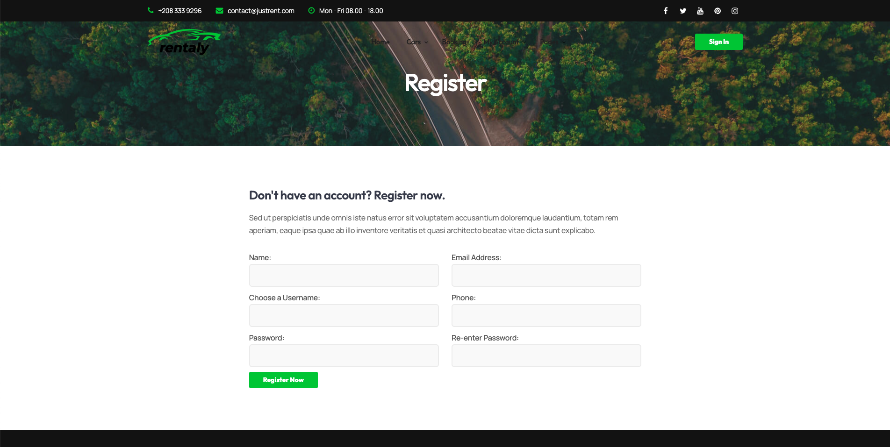
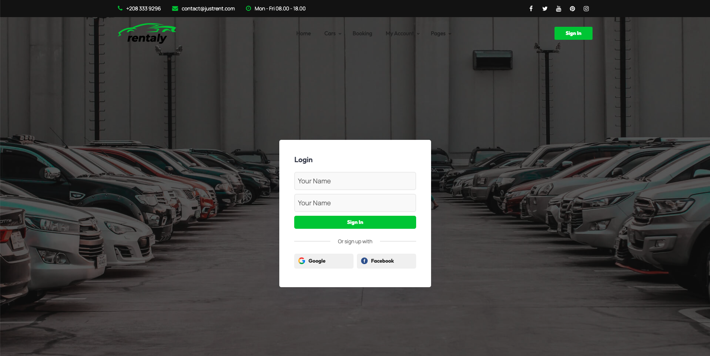
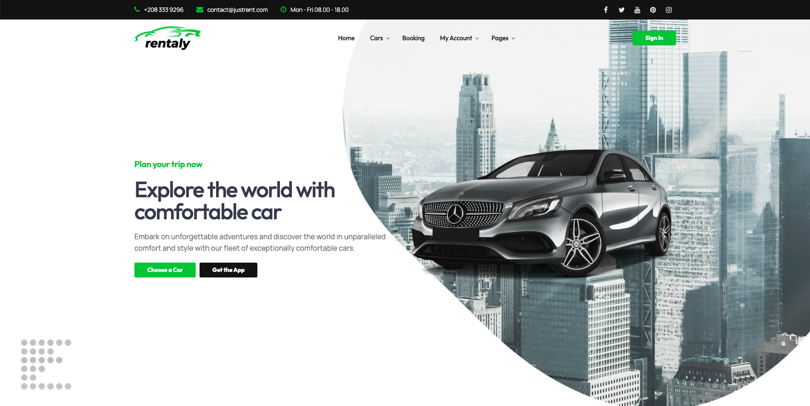
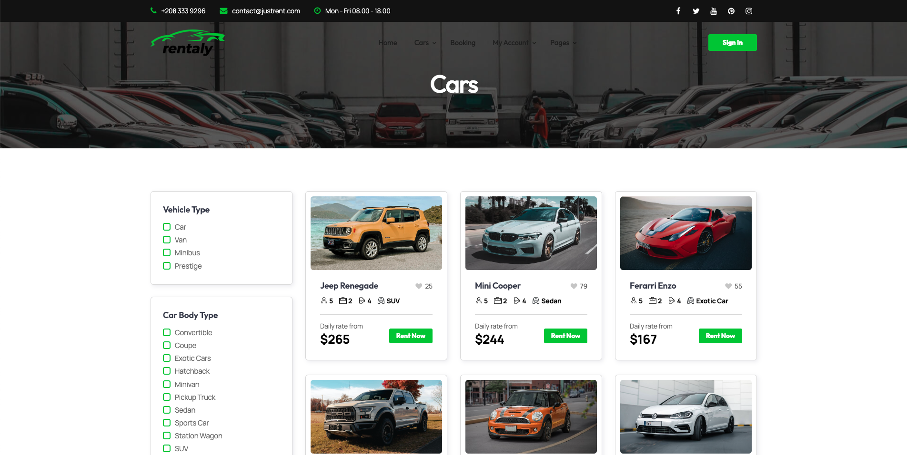
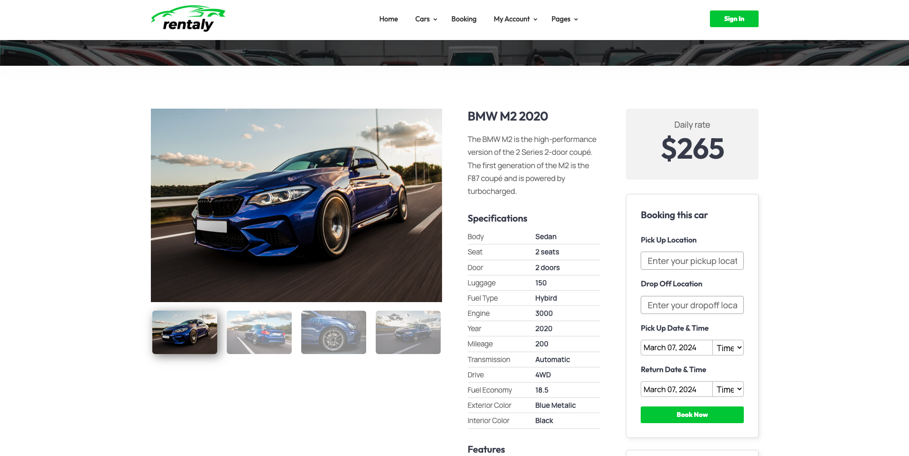
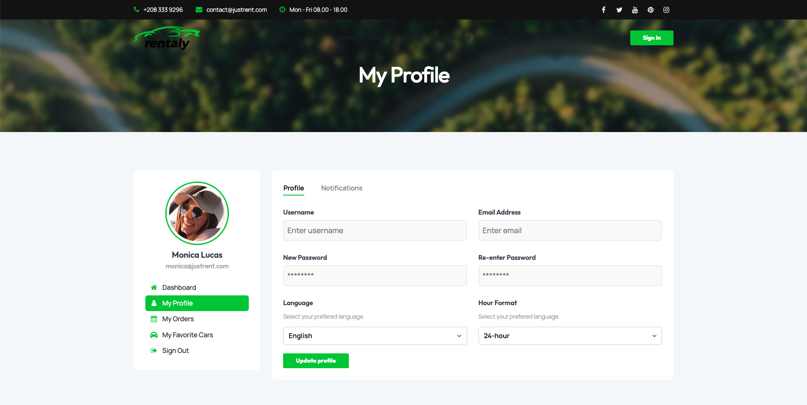
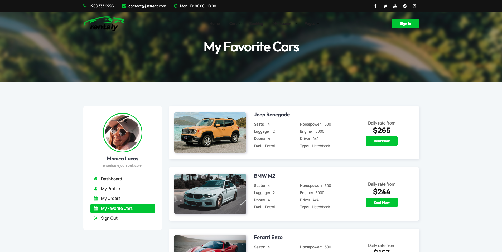
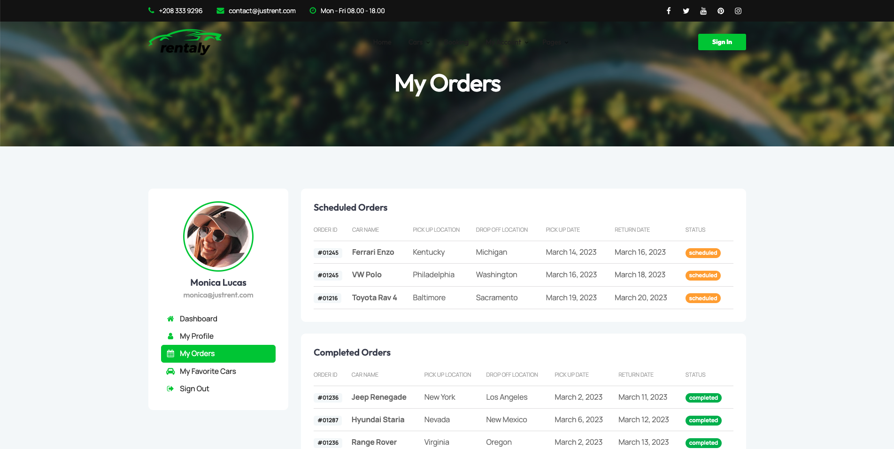
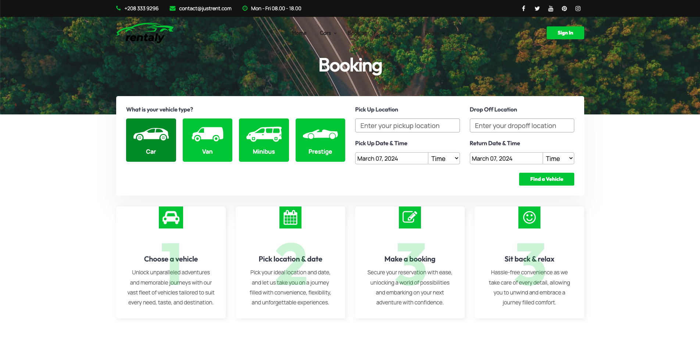

# 撰寫各頁面的 User Story 
#### * Register
- User can sign up for new member.

#### * Login
- User can sign in with available name and password.
- User can choose to use Google/ Facebook account to sign up.

#### * Home page
- User can go to cars page to choose the car.
- User can go to booking page to book the car.
- User can go to the user profile.
- User can go to the single car page.
- User can read the newest post.
- User can know more about the website.

#### * Cars Page (Grid & List mode)
- User can find all cars' info in this page.
- User can get the base info of each car.
- User can find the car with the filters.
- User can push the button to rent the car.
- User can add/ cancel the like of the car. 

#### * Single Car
- User can view the detailed car's info.
- User can rent the car.

#### * Profile
- User can edit the own profile.
- USer can link to the one's own order and favorite page.

#### * Favorite
- User can view the favorite list.
- User can rent the car.

#### * Orders
- User can view the order history and schedule status.

#### * Booking
- User can book the car.
- User can view the steps of booking.
- User can view the reviews and cases of the company.

